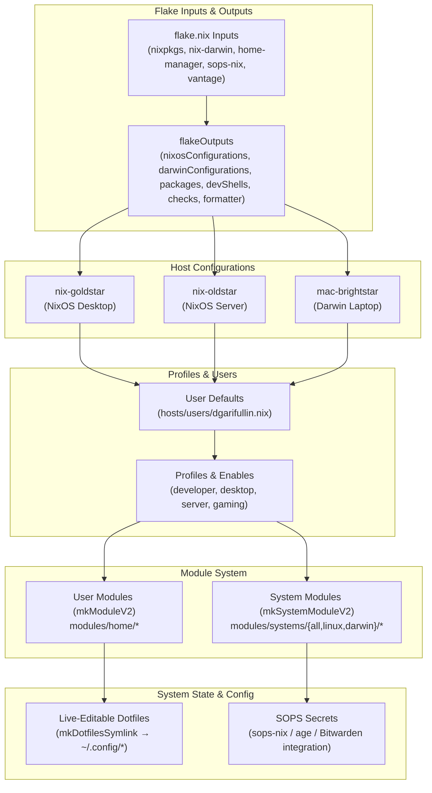

# 🏠 Nix Configuration

[](https://nixos.org/)
[](https://github.com/LnL7/nix-darwin)
[](LICENSE)
[](https://github.com/GDR/dot/actions)

Personal NixOS & nix-darwin configuration with a modular, hierarchical architecture.

### Why Nix?

> *"Works on my machine"* → *"Works on every machine"*

Nix is a purely functional package manager that treats system configuration as code. The same configuration always produces the same system — whether you're setting up a fresh laptop or rebuilding after a disaster. Made a mistake? Just boot into a previous generation and you're back to a working state in seconds.

Everything is declarative: packages, services, dotfiles, even your desktop environment. No more scattered configs or forgotten setup steps. Your entire system lives in version-controlled `.nix` files that work across all your machines — Linux desktops, macOS laptops, headless servers.

Updates are atomic (they fully apply or don't touch anything), and different package versions coexist peacefully. No dependency hell, no "I updated X and now Y is broken". Just reproducible, reliable systems.

---

## ✨ Features

- 🖥️ **Multi-platform** — Same structure for NixOS and macOS (nix-darwin)
- 👥 **Multi-user ready** — Each user can have different modules enabled
- 🎯 **Hierarchical enables** — Enable at any path level: `home.browsers.enable` or `home.browsers.vivaldi.enable`
- ✏️ **Live-editable dotfiles** — Config files are symlinked to this repo, edit in place without rebuild
- 🔍 **Auto-discovery** — Drop a `.nix` file in any module directory, it's automatically imported

---

## 📑 Table of Contents

- [Quick Start](#-quick-start)
- [Architecture](#-architecture)
  - [Architecture Diagram](#architecture-diagram)
  - [Directory Structure](#directory-structure)
  - [Module Types](#module-types)
- [Guides](#-guides)
  - [Create a New Host](#create-a-new-host)
  - [Create a New User](#create-a-new-user)
  - [Per-User Module Configuration](#per-user-module-configuration)
  - [Create a New Module](#create-a-new-module)
- [Secrets Management (SOPS)](#-secrets-management-sops)
- [Vantage Infrastructure Stub](#-vantage-infrastructure-stub)
- [Host Configuration](#-host-configuration)
- [License](#-license)

---

## 🚀 Quick Start

```bash
# Clone the repository
git clone https://github.com/gdr/dot.git ~/Workspaces/gdr/dot
cd ~/Workspaces/gdr/dot

# Apply configuration
# NixOS:
sudo nixos-rebuild switch --flake .#<hostname>

# macOS:
darwin-rebuild switch --flake .#<hostname>
```

---

## 🏗 Architecture

### Architecture Diagram



### Directory Structure

```
.
├── flake.nix                 # Entry point - defines hosts and imports
├── hosts/
│   ├── users/                # User defaults (imported by machines)
│   │   └── dgarifullin.nix
│   └── machines/             # Machine configurations
│       ├── nix-goldstar/     # NixOS host
│       │   ├── default.nix
│       │   └── hardware-configuration.nix
│       └── mac-brightstar/   # Darwin host
│           └── default.nix
├── lib/
│   └── default.nix           # Helper functions (mkModule, mkDotfilesSymlink)
├── modules/
│   ├── _core/                # Core module infrastructure
│   │   ├── registry.nix      # Module registry builder
│   │   └── user.nix          # hostUsers options & home-manager setup
│   ├── systems/
│   │   ├── all/              # Cross-platform system modules
│   │   │   ├── fonts.nix
│   │   │   ├── nix/
│   │   │   │   ├── gc.nix
│   │   │   │   └── settings.nix
│   │   │   └── shell/
│   │   │       ├── git.nix
│   │   │       └── ssh.nix
│   │   ├── linux/            # Linux-only system modules
│   │   │   ├── desktop/
│   │   │   │   ├── awesomewm/
│   │   │   │   └── hyprland/
│   │   │   ├── graphics/
│   │   │   ├── keyboards/
│   │   │   ├── networking/
│   │   │   └── sound.nix
│   │   └── darwin/           # macOS-only system modules
│   └── home/                 # User-level modules (enabled hierarchically)
│       ├── browsers/
│       ├── cli/
│       ├── desktop/
│       │   ├── appearance/
│       │   ├── services/
│       │   ├── utils/
│       │   └── widgets/
│       ├── editors/
│       ├── games/
│       ├── media/
│       ├── messengers/
│       ├── security/
│       ├── shell/
│       └── terminal/
└── pkgs/                     # Custom packages
```

### Module Types

| Type | Location | Enabled via | Scope |
|------|----------|-------------|-------|
| **System (All)** | `systems/all/` | `modules.system.all.<name>.enable` | System-wide, cross-platform |
| **System (Linux)** | `systems/linux/` | `modules.system.linux.<name>.enable` | System-wide, Linux only |
| **System (Darwin)** | `systems/darwin/` | `modules.system.darwin.<name>.enable` | System-wide, macOS only |
| **User** | `home/` | `hostUsers.<user>.modules.<path>.enable` | Per-user, hierarchical enables |

---

## 📖 Guides

### Create a New Host

1. **Create host directory:**

```bash
mkdir -p hosts/machines/my-new-host
```

2. **Create `default.nix`:**

```nix
# hosts/machines/my-new-host/default.nix
{ config, lib, pkgs, ... }:
let
  importUser = name: import ../../users/${name}.nix { inherit lib; };
in
{
  imports = [ ./hardware-configuration.nix ];

  # User configuration
  hostUsers.dgarifullin = importUser "dgarifullin" // {
    enable = true;
    keys = [{
      name = "my-new-host";
      type = "rsa";
      purpose = [ "git" "ssh" ];
      isDefault = true;
    }];
    # Hierarchical module enables
    modules = {
      home.cli.enable = true;
      home.shell.enable = true;
      home.editors.enable = true;
      # Or enable specific modules:
      # home.browsers.vivaldi.enable = true;
    };
  };

  networking.hostName = "my-new-host";

  # System modules
  modules.system.all = {
    fonts.enable = true;
    nix.settings.enable = true;
    nix.gc.enable = true;
    shell.ssh.enable = true;
    shell.git.enable = true;
  };

  # Linux-specific (remove for Darwin)
  modules.system.linux = {
    desktop.hyprland.enable = true;
    networking.networkmanager.enable = true;
    sound.enable = true;
  };

  time.timeZone = "Europe/Moscow";
}
```

3. **Generate hardware config (NixOS):**

```bash
nixos-generate-config --show-hardware-config > hosts/machines/my-new-host/hardware-configuration.nix
```

4. **Add to `flake.nix`:**

```nix
nixosConfigurations.my-new-host = mkNixosConfiguration ./hosts/machines/my-new-host;
# or for Darwin:
darwinConfigurations.my-new-host = mkDarwinConfiguration ./hosts/machines/my-new-host;
```

---

### Create a New User

1. **Create user defaults:**

```nix
# hosts/users/newuser.nix
{ lib, ... }:
{
  enable = lib.mkDefault false;
  fullName = lib.mkDefault "New User";
  email = lib.mkDefault "newuser@example.com";
  github = lib.mkDefault "newuser";
  extraGroups = lib.mkDefault [ "wheel" "audio" "video" ];
}
```

2. **Enable in host config:**

```nix
# hosts/machines/my-host/default.nix
hostUsers.newuser = importUser "newuser" // {
  enable = true;
  keys = [{
    name = "my-host";
    type = "rsa";
    purpose = [ "git" "ssh" ];
    isDefault = true;
  }];
  # Hierarchical module enables
  modules = {
    home.core.enable = true;
    home.shell.enable = true;
    home.media.vlc.enable = true;  # specific module
  };
};
```

---

### Per-User Module Configuration

Configure modules per-user using hierarchical enables:

```nix
hostUsers.dgarifullin = importUser "dgarifullin" // {
  enable = true;

  modules = {
    # Enable entire categories
    home.browsers.enable = true;     # enables vivaldi, chromium, etc.
    home.editors.enable = true;      # enables neovim, cursor, etc.

    # Or enable specific modules
    home.media.vlc.enable = true;    # just vlc
    home.media.spotify.enable = true;
  };
};
```

**Hierarchical enables:**
- `home.enable = true` → enables ALL home modules
- `home.browsers.enable = true` → enables all browsers
- `home.browsers.vivaldi.enable = true` → enables just vivaldi

Module paths follow the directory structure: `home.<category>.<module-name>`

---

### Create a New Module

#### User Module

```nix
# modules/home/tools/my-tool.nix
{ lib, pkgs, ... }@args:

lib.my.mkModuleV2 args {
  description = "My awesome tool";
  platforms = [ "linux" "darwin" ];  # optional, defaults to both

  module = {
    # Cross-platform config (goes to home-manager.users.*)
    allSystems.home.packages = [ pkgs.my-tool ];

    # Or platform-specific
    nixosSystems.programs.my-tool.enable = true;
    darwinSystems.homebrew.casks = [ "my-tool" ];
  };
}
```

#### System Module (Linux)

```nix
# modules/systems/linux/services/my-service.nix
{ lib, pkgs, config, ... }@args:

let
  enabledUsers = lib.filterAttrs (_: u: u.enable) config.hostUsers;
in
lib.my.mkSystemModuleV2 args {
  namespace = "linux";
  description = "My service";

  module = _: {
    # System-level NixOS options
    services.my-service.enable = true;

    # User packages via home-manager
    home-manager.users = lib.mapAttrs (name: _: {
      home.packages = [ pkgs.my-tool-client ];
    }) enabledUsers;
  };
}
```

#### Auto-discovery

Modules are **auto-discovered** recursively! Just create your `.nix` file in the right directory and it's automatically imported. No manual import lists needed.

---

### Dotfile Symlink Modes (Nix Store vs. Live Edit)

Dotfiles support two modes on a per-module basis:

1. 📦 **Settled / Store Mode (`live = false`, default):** Copies dotfiles into `/nix/store`. Store paths are captured in NixOS / Home Manager generations, allowing NixOS & GRUB generation rollbacks (`nixos-rebuild switch --rollback` or GRUB boot menu) to restore historical dotfile revisions cleanly.
2. 🛠️ **Live Mode (`live = true`):** Symlinks point out-of-store directly to `$DOTFILES_DIR`. Edit files directly during active development and changes apply immediately without `nixos-rebuild switch`.

#### How to Configure

- **In Module Definition:**
```nix
dotfiles = {
  path = "ghostty/config";
  source = "modules/home/terminal/ghostty/dotfiles/config";
  live = true; # Set to true during active development
};
```

- **Per-Module Override in Host Config:**
```nix
# hosts/machines/nix-goldstar/default.nix
modules.home.terminal.ghostty.dotfilesLive = true;  # Enable live edit for active dev
modules.home.editors.neovim.dotfilesLive = false;   # Store mode for settled neovim config
```

---

## 🔐 Secrets Management (SOPS)

Secrets across the repository are managed using [`sops-nix`](https://github.com/Mic92/sops-nix) with `age` encryption.

### Key Derivation (`ssh-to-age`)
Host age keys are derived directly from SSH host keys (`/etc/ssh/ssh_host_ed25519_key.pub`), eliminating the need to store secondary key files on machine hosts:

```bash
# Derive host age key from SSH host key
nix-shell -p ssh-to-age --run 'ssh-to-age < /etc/ssh/ssh_host_ed25519_key.pub'
```

### Age Key Locations
- **Linux / NixOS**: `~/.config/sops/age/keys.txt` (XDG standard compliant).
- **macOS / Darwin**: `~/Library/Application Support/sops/age/keys.txt` (Environment variable `SOPS_AGE_KEY_FILE` is automatically set by `modules.system.all.sops.enable`).

### Shell Wrapper & Bitwarden Integration
A shell wrapper (`sops`) is provided in Zsh (`common.zsh`). If `SOPS_AGE_KEY` is not present, it dynamically fetches the per-machine SOPS key from Bitwarden CLI (`bw get notes "SOPS Age Key <hostname>"`) and caches it in RAM (`/tmp/.sops-age-key-<hostname>-<uid>`) for 15 minutes.

### Managing Secrets
Secrets are specified in `.sops.yaml` with creation rules targeting host secrets paths (e.g., `hosts/machines/<host>/secrets/*`). Edit or create secrets using:

```bash
sops hosts/machines/<host>/secrets/<secret-name>
```

---

## 🔌 Vantage Infrastructure Stub

`vantage` is an optional infrastructure flake input containing private service modules (Consul, Nomad, Vault, Vault Agent sidecar, remote builder configuration, Consul DNS).

### Public Stub Mechanism
To ensure the repository remains fully open-source, evaluation-ready, and buildable on public CI without needing private SSH keys:
- By default, `flake.nix` points `vantage` to a public stub repository:
  `github:GDR/dot-stubs?dir=vantage`
- The stub exposes no-op modules and default options, allowing all host configurations (`nix-goldstar`, `nix-oldstar`, `mac-brightstar`) to evaluate cleanly without private repo access.

### Override Workflow for Infra Hosts
When deploying to active infrastructure nodes (`nix-oldstar` or `mac-brightstar`), override the `vantage` input to point to the private repository:

```bash
# Manual override during rebuild:
nixos-rebuild switch --flake .#nix-oldstar --override-input vantage git+ssh://git@github.com/GDR/vantage

# Or using Makefile helper targets:
make nix-oldstar
make mac-brightstar
```

---

## 🖥 Host Configuration

| Host | Platform | Description |
|------|----------|-------------|
| `nix-goldstar` | NixOS (x86_64-linux) | Desktop workstation with Hyprland & NVIDIA |
| `nix-oldstar` | NixOS (x86_64-linux) | Server & remote builder (ThinkPad T480 homelab) |
| `mac-brightstar` | Darwin (aarch64-darwin) | MacBook Pro workstation |

---

## 📂 Module Reference

Enable modules hierarchically per-user:

```nix
hostUsers.myuser.modules = {
  home.browsers.enable = true;    # enables all browsers
  home.core.enable = true;        # enables htop, shell-utils
  home.shell.enable = true;       # enables zsh, tmux
  home.editors.neovim.enable = true;  # specific module
};
```

| Path | Modules |
|------|---------|
| `home.core` | htop, shell-utils (bat, fzf, wget, direnv) |
| `home.shell` | zsh with oh-my-zsh, zplug, tmux |
| `home.terminal` | ghostty |
| `home.browsers` | chromium, vivaldi |
| `home.editors` | cursor, neovim (nixvim) |
| `home.desktop` | rofi, dunst, brightnessctl, pamixer, wayland-utils |
| `home.media` | vlc, spotify |
| `home.messengers` | telegram |
| `home.games` | steam |
| `home.security` | keepassxc, bitwarden |
| `home.downloads` | qbittorrent |
| `home.virtualisation` | docker |
| `home.utils` | raycast (darwin), macfuse (darwin) |

---

## 📄 License

MIT License - see [LICENSE](LICENSE) for details.
