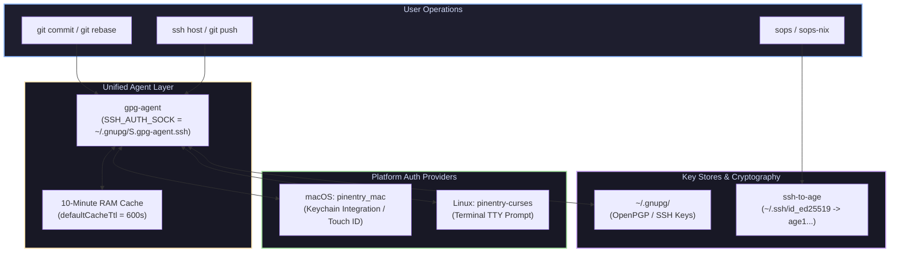
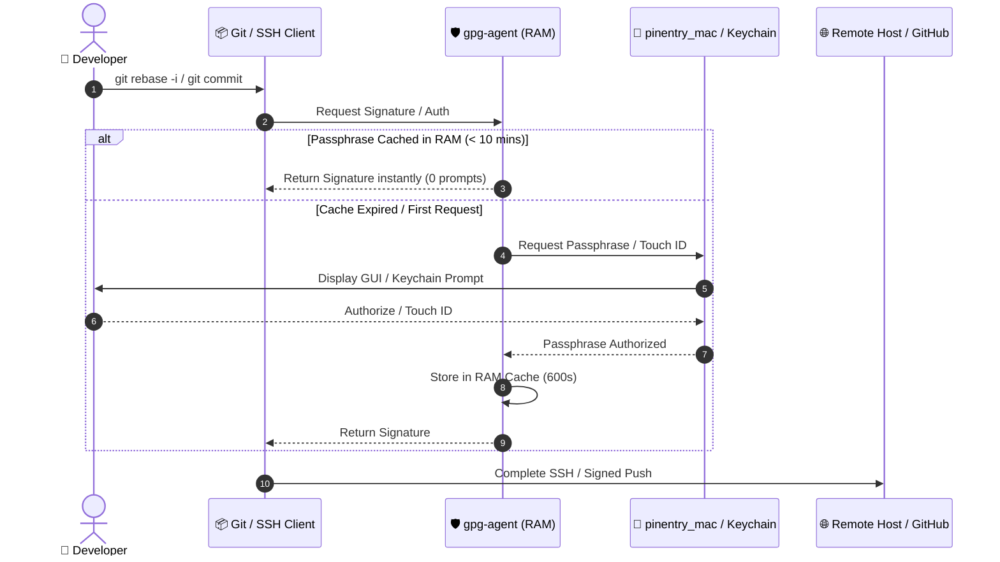
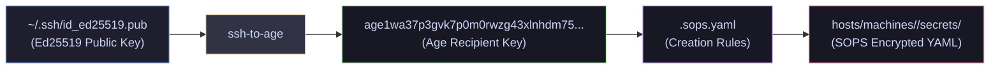
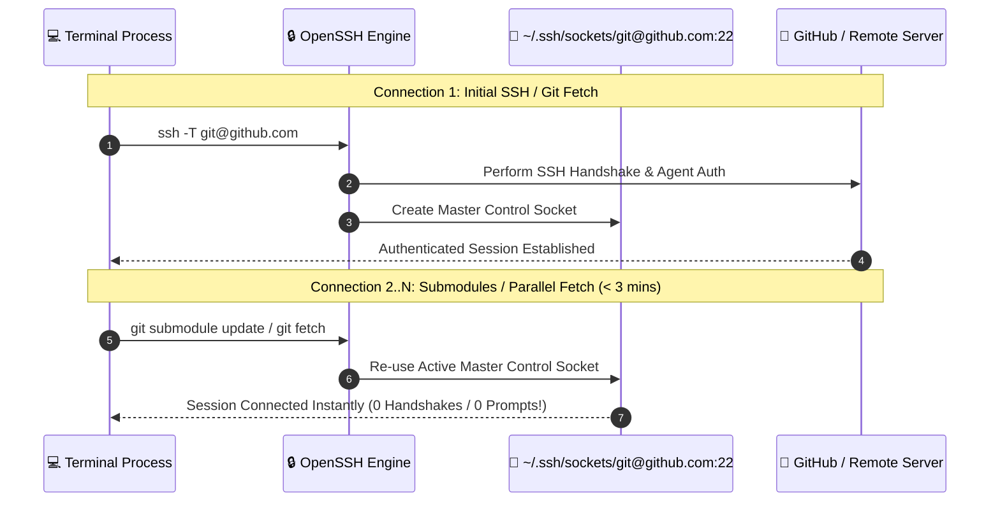

# 🛡️ Security Architecture

Comprehensive guide to key management, authentication agent architecture, secret decryption, and SSH multiplexing across NixOS and macOS hosts in `GDR/dot`.

---

## 📐 System Architecture

The dotfiles repository uses a **unified `gpg-agent` architecture** across both macOS (`mac-brightstar`) and Linux (`nix-goldstar`, `nix-oldstar`).

---

## 🔑 Core Security Subsystems

### 1. Unified Authentication Agent (`gpg-agent`)

> [!NOTE]
> Single daemon managing both OpenPGP commit signing and OpenSSH authentication.

| Component | Configuration | Purpose |
| :--- | :--- | :--- |
| **Agent Daemon** | `services.gpg-agent.enable = true` | Manages private keys in memory. |
| **SSH Emulation** | `services.gpg-agent.enableSshSupport = true` | Exposes `~/.gnupg/S.gpg-agent.ssh` for SSH. |
| **Cache TTL** | `defaultCacheTtl = 600` (10 mins) | Eliminates repetitive prompts during multi-commit rebases. |
| **Max TTL** | `maxCacheTtl = 7200` (2 hours) | Hard upper bound before re-authentication. |

---

### 2. Authentication Flow & Caching

The diagram below illustrates how `gpg-agent` handles authentication during interactive commands versus cached sub-ops:

---

### 3. Secret Management (`sops-nix` & `ssh-to-age`)

> [!IMPORTANT]
> `sops-nix` encrypts repository secrets using `age` public keys derived directly from `Ed25519` SSH keys.

---

### 4. SSH Connection Multiplexing (`ControlMaster`)

> [!TIP]
> Connection multiplexing reuses a single TCP tunnel for multiple connections to the same host within 3 minutes.

| Directive | Value | Purpose |
| :--- | :--- | :--- |
| `ControlMaster` | `auto` | Automatically creates a master connection if none exists. |
| `ControlPath` | `~/.ssh/sockets/%r@%h:%p` | Path template for control sockets (`0700` permissions). |
| `ControlPersist` | `3m` | Keeps background connection alive for 3 minutes after idle. |
| `IdentitiesOnly` | `yes` | Restricts key offerings to explicitly defined `IdentityFile` entries. |
