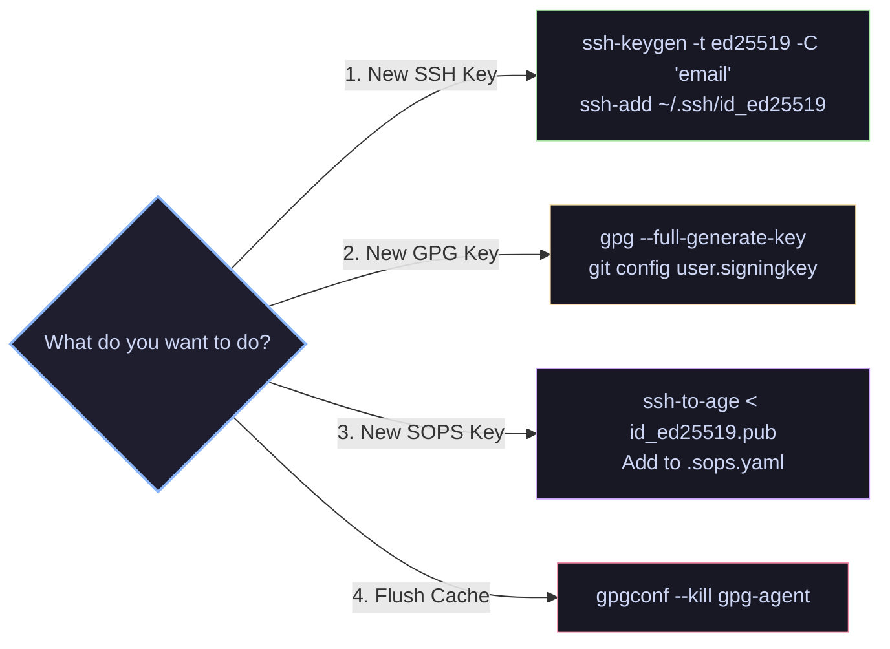
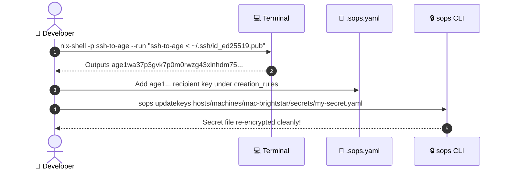

# 📘 Security & Key Management Runbook

Step-by-step operational runbook for key generation, agent setup, Git commit signing, and secret management in `GDR/dot`.

---

## 🚀 Quick Reference Workflow



---

## 🔑 1. Key Generation Guide

### A. Generating a New SSH Key (Ed25519)

> [!NOTE]
> `Ed25519` is the modern standard for SSH keys, offering fast performance and clean cryptographic design.

1. **Generate the key pair**:
   ```bash
   ssh-keygen -t ed25519 -C "gosugdr@gmail.com" -f ~/.ssh/id_ed25519
   ```

2. **Add the key to `gpg-agent`**:
   ```bash
   ssh-add ~/.ssh/id_ed25519
   ```

3. **Verify loaded keys**:
   ```bash
   ssh-add -l
   ```

---

### B. Generating a New GPG Key for Git Commit Signing

> [!TIP]
> Use **ECC (Ed25519)** for lightweight, fast GPG keys.

1. **Run interactive key generator**:
   ```bash
   gpg --full-generate-key
   ```
   * **Key type**: `(9) ECC and ECC` (or `(1) RSA and RSA`)
   * **Elliptic Curve**: `(1) Curve 25519`
   * **Expiration**: `0` (does not expire) or `2y`
   * **Real Name**: `Damir Garifullin`
   * **Email**: `gosugdr@gmail.com`

2. **Find your Key ID**:
   ```bash
   gpg --list-secret-keys --keyid-format=long
   ```
   Output:
   ```text
   sec   ed25519/3AA5C34371567BD2 2026-07-22 [SC]
   uid                 [ultimate] Damir Garifullin <gosugdr@gmail.com>
   ```
   👉 Key ID is **`3AA5C34371567BD2`**.

3. **Configure Git to use your GPG Key**:
   ```bash
   git config --global user.signingkey 3AA5C34371567BD2
   git config --global gpg.format openpgp
   git config --global commit.gpgSign true
   ```

---

### C. Generating / Deriving an Age Key for SOPS Secrets

> [!IMPORTANT]
> `sops-nix` uses `age` public keys. Convert your `id_ed25519.pub` using `ssh-to-age`.



1. **Derive Age public key from SSH key**:
   ```bash
   nix-shell -p ssh-to-age --run "ssh-to-age < ~/.ssh/id_ed25519.pub"
   ```
   *(Output: `age1wa37p3gvk7p0m0rwzg43xlnhdm75...`)*

2. **Add recipient key to [.sops.yaml](file:///Users/dgarifullin/Workspaces/gdr/dot/.sops.yaml)**:
   ```yaml
   creation_rules:
     - path_regex: hosts/machines/mac-brightstar/secrets/.*
       age:
         - age1wa37p3gvk7p0m0rwzg43xlnhdm75... # id_ed25519
   ```

3. **Re-encrypt existing secrets**:
   ```bash
   sops updatekeys hosts/machines/mac-brightstar/secrets/<secret-name>.yaml
   ```

---

## 🌐 2. Authorizing SSH Access to Remote Hosts (`nix-oldstar`)

### Declarative Method (Recommended)
Add your public key to `keys` in [hosts/machines/nix-oldstar/default.nix](file:///Users/dgarifullin/Workspaces/gdr/dot/hosts/machines/nix-oldstar/default.nix#L31-L36):

```nix
hostUsers.dgarifullin = userDefaults.user // {
  enable = true;
  keys = [
    {
      name = "brightstar";
      type = "ed25519";
      publicKey = "ssh-ed25519 AAAAC3NzaC1lZDI1NTE5AAAAI...";
      purpose = [ "ssh" ];
    }
  ];
};
```

### Imperative Method
```bash
ssh-copy-id -i ~/.ssh/id_ed25519.pub dgarifullin@nix-oldstar
```

---

## 🛠️ 3. Maintenance & Troubleshooting

| Goal | Command |
| :--- | :--- |
| **Flush RAM Passphrase Cache** | `gpgconf --kill gpg-agent` |
| **Close Stuck ControlMaster Socket** | `ssh -O exit nix-oldstar` |
| **List Active Control Sockets** | `ls -la ~/.ssh/sockets/` |
| **List Loaded Agent Keys** | `ssh-add -l` |
| **Test SSH Authentication** | `ssh -v -T git@github.com` |
