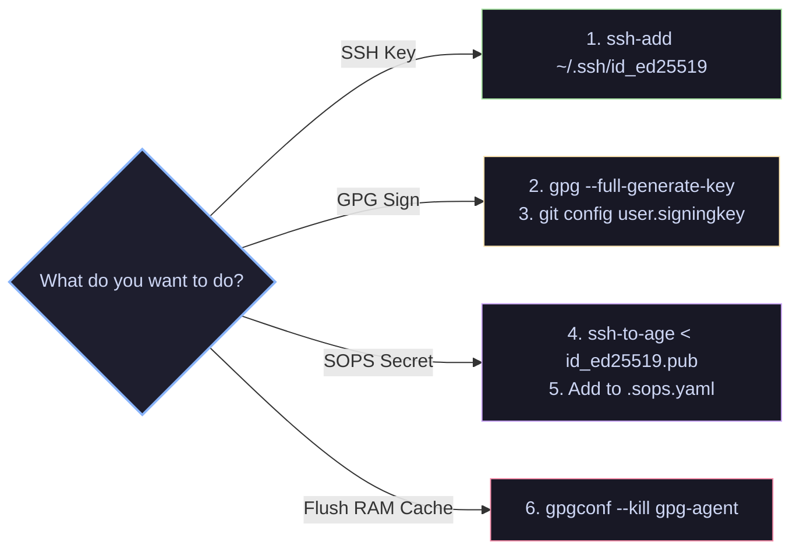
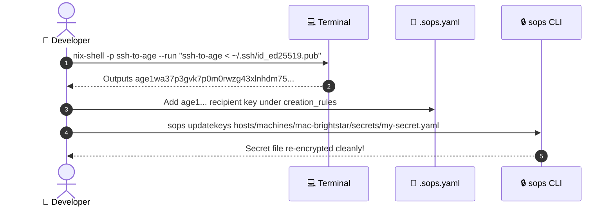

# 📘 Security & Key Management Runbook

Step-by-step operational runbook for frequent security tasks, key rotation, Git signing, and secret management in `GDR/dot`.

---

## 🚀 Quick Reference Workflow



---

## 1. Adding an SSH Key to `gpg-agent`

> [!NOTE]
> `SSH_AUTH_SOCK` is automatically exported as `$HOME/.gnupg/S.gpg-agent.ssh` by Home Manager.

1. **Add your SSH private key**:
   ```bash
   ssh-add ~/.ssh/id_ed25519
   ```

2. **Verify loaded identities**:
   ```bash
   ssh-add -l
   ```
   *(This records the keygrip into `~/.gnupg/sshcontrol` so `gpg-agent` remembers the key).*

---

## 2. Setting Up GPG Commit Signing

### Step 1: Generate or Import a GPG Key

* **Generate a new ECC key**:
  ```bash
  gpg --full-generate-key
  ```
  *(Select `ECC and ECC`, curve `ed25519`, enter your name and `gosugdr@gmail.com`)*.

* **Or import an existing key**:
  ```bash
  gpg --import /path/to/private-key.asc
  ```

### Step 2: Retrieve Your Key ID

```bash
gpg --list-secret-keys --keyid-format=long
```

Output:
```text
sec   ed25519/3AA5C34371567BD2 2026-07-22 [SC]
uid                 [ultimate] Damir Garifullin <gosugdr@gmail.com>
```
👉 Your Key ID is **`3AA5C34371567BD2`**.

### Step 3: Configure Git

```bash
git config --global user.signingkey 3AA5C34371567BD2
git config --global gpg.format openpgp
git config --global commit.gpgSign true
```

> [!TIP]
> **One-Time Passphrase Save**: On the first `git commit`, `pinentry-mac` will open a dialog. Enter your passphrase and check **"Save in Keychain"**. `gpg-agent` will cache it for 10 minutes, making `git rebase` completely prompt-free!

---

## 3. Configuring Keys for SOPS Secret Encryption (`sops-nix`)

> [!IMPORTANT]
> `sops-nix` uses `age` public keys. Convert your `id_ed25519.pub` using `ssh-to-age`.



1. **Convert SSH public key to Age format**:
   ```bash
   nix-shell -p ssh-to-age --run "ssh-to-age < ~/.ssh/id_ed25519.pub"
   ```

2. **Add recipient key to [.sops.yaml](file:///Users/dgarifullin/Workspaces/gdr/dot/.sops.yaml)**:
   ```yaml
   creation_rules:
     - path_regex: hosts/machines/mac-brightstar/secrets/.*
       age:
         - age1wa37p3gvk7p0m0rwzg43xlnhdm75... # id_ed25519
   ```

3. **Update existing secrets**:
   ```bash
   sops updatekeys hosts/machines/mac-brightstar/secrets/<secret-name>.yaml
   ```

---

## 4. Authorizing SSH Access to Remote Hosts (`nix-oldstar`)

### Declarative Method (Recommended)
Add your public key to `keys` in [hosts/machines/nix-oldstar/default.nix](file:///Users/dgarifullin/Workspaces/gdr/dot/hosts/machines/nix-oldstar/default.nix#L31-L36):

```nix
hostUsers.dgarifullin = userDefaults.user // {
  enable = true;
  keys = [
    {
      name = "brightstar";
      type = "ed25519";
      publicKey = "ssh-ed25519 AAAAC3NzaC1lZDI1NTE5AAAAI...";
      purpose = [ "ssh" ];
    }
  ];
};
```

### Imperative Method
```bash
ssh-copy-id -i ~/.ssh/id_ed25519.pub dgarifullin@nix-oldstar
```

---

## 5. Maintenance & Troubleshooting

| Goal | Command |
| :--- | :--- |
| **Flush RAM Passphrase Cache** | `gpgconf --kill gpg-agent` |
| **Close Stuck ControlMaster Socket** | `ssh -O exit nix-oldstar` |
| **List Active Control Sockets** | `ls -la ~/.ssh/sockets/` |
| **List Loaded Agent Keys** | `ssh-add -l` |
| **Test SSH Authentication** | `ssh -v -T git@github.com` |
